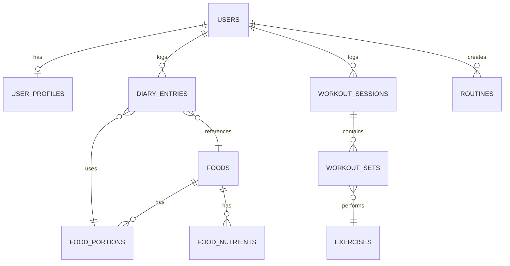

# Database Design

## Strategy
The database is a normalized relational schema in MySQL 8. All primary keys are UUIDs (stored as `VARCHAR(36)`) to support offline-first mobile synchronization without ID collisions.

## Key Entities
- **users**: Authentication and identity.
- **user_profiles**: Contains biometric data (weight, height, dob, sex) and goals.
- **foods**: Master food catalog.
- **food_portions**: Serving sizes and gram equivalents.
- **food_nutrients**: Normalized macro and micro nutrients per 100g.
- **diary_entries**: User food logs. Contains snapshot columns (`calories_snapshot`, `protein_snapshot`, etc.) to guarantee historical immutability.
- **exercises**: Master catalog of exercises.
- **routines**: User-created workout templates.
- **workout_sessions**: Execution of a routine or ad-hoc workout.
- **workout_sets**: Individual sets logged within a session.

## Versioning & Historical Data
When a user logs a food entry in `diary_entries`, the exact nutrient values calculated for that serving at that moment are saved directly onto the `diary_entries` row. If the master `foods` record is updated later, the historical log remains unchanged.

## Soft Deletion
User-generated content (diary entries, routines, workouts) uses a `deleted_at` timestamp. This allows the mobile app to sync deletions to the backend without hard-deleting records that might have unresolved sync conflicts.

## ER Diagram (Mermaid)

